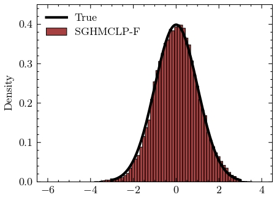
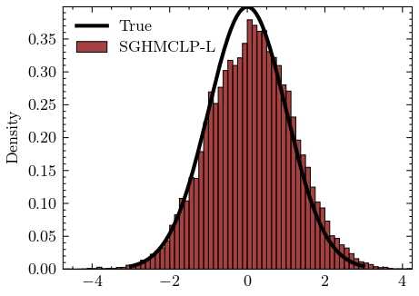
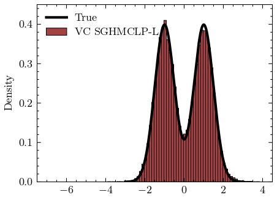
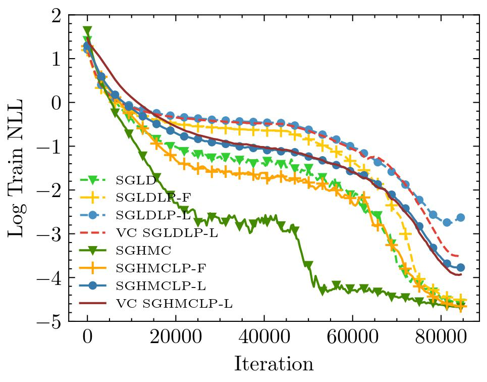
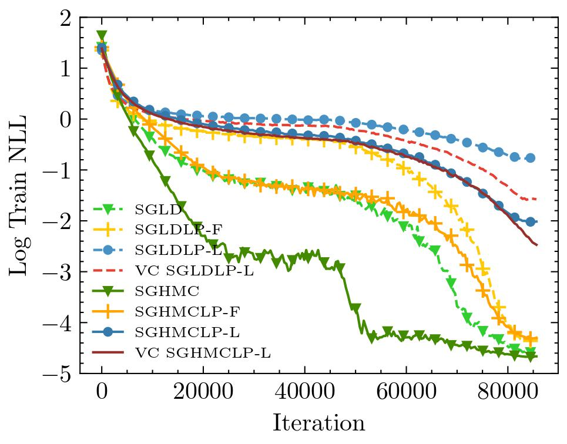

# Enhancing Low-Precision Sampling via Stochastic Gradient Hamiltonian Monte Carlo
This repository contains code for the paper [Enhancing Low-Precision Sampling via Stochastic Gradient Hamiltonian Monte Carlo](https://arxiv.org/pdf/2310.16320.pdf), accepted in 
Transactions on Machine Learning Research.

```bibtex
@article{wang2023enhancing,
title={Enhancing Low-Precision Sampling via Stochastic Gradient Hamiltonian Monte Carlo},
author={Wang, Ziyi and Chen, Yujie and Song, Qifan and Zhang, Ruqi},
journal={arXiv preprint arXiv:2310.16320},
year={2023}
}
```

# Introduction
Low-precision training has emerged as a promising low-cost technique to enhance the training efficiency of deep neural networks without sacrificing much accuracy.
Its Bayesian counterpart can further provide uncertainty quantification and improved generalization accuracy.
This paper investigates low-precision sampling via Stochastic Gradient Hamiltonian Monte Carlo (SGHMC) with low-precision and full-precision gradient accumulators for both strongly log-concave and non-log-concave distributions.
Theoretically, our results show that to achieve $\epsilon$-error in the 2-Wasserstein distance for non-log-concave distributions, low-precision SGHMC achieves quadratic improvement ($\mathcal{O}$ ($\epsilon^{-2}{\mu^{\*}}^{-2}\log^2$($\epsilon^{-1}$))) compared to the state-of-the-art low-precision sampler, 
Stochastic Gradient Langevin Dynamics (SGLD) ($\mathcal{O}$ ($\epsilon^{-4}{\lambda^{\*}}^{-1}\log^5$($\epsilon^{-1}$))). 
Moreover, we prove that low-precision SGHMC is more robust to the quantization error compared to low-precision SGLD due to the robustness of the momentum-based update w.r.t. gradient noise. 
Empirically, we conduct experiments on synthetic data, and MNIST, CIFAR-10 \& CIFAR-100 datasets, which validate our theoretical findings. Our study highlights the potential of low-precision SGHMC as an efficient and accurate sampling method for large-scale and resource-limited machine learning.


<p align="center">
    
    
    
</p>

<p align="center">
    
    
    
</p>

<p align="center">
    
    
</p>

# Usage
## Gaussian Distribution
To reproduce the results of SGHMC on Mixture-Gaussian. 
```
cd script
sh mixGaussian_lowfull.sh     # Low-precision Full SGHMC
sh mixGaussian_lowlow.sh     # Low-precision Low SGHMC
sh mixGaussian_vc.sh     # Variance Corrected SGHMC
```

## CIFAR Datasets
To reproduce the result of SGHMC on CIFAR 100.
```
cd script
sh train_low_full.sh     # Low-precision Full SGHMC
sh train_low_low.sh     # Low-precision Low SGHMC
sh train_vc.sh       # Variance Corrected SGHMC
```

